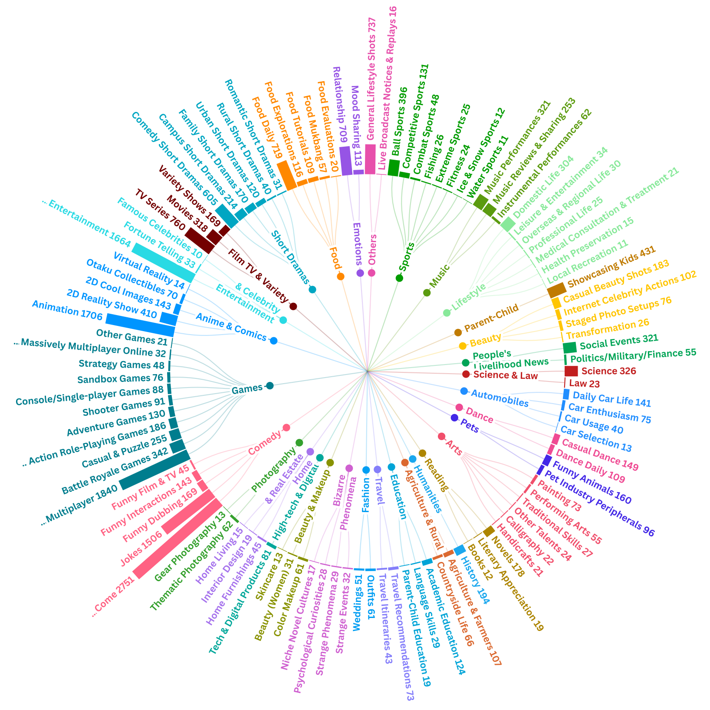

# LIBERO-X: Robustness Litmus for Vision-Language-Action Models

 [[Project Page (TBD)](#)] [[Paper (TBD)](#)] 

Repository for LIBERO-X. Code and datasets will be released here.

## Introduction

      
    Placeholder figure for LIBERO-X (to be updated).
     

    
     
    Placeholder figure for LIBERO-X (to be updated).
     

For more details, please refer to the project page: <a href="#">Project Page (TBD)</a>.

## Acknowledgments
Parts of this project page were adopted from the [Academic Project Page Template](https://eliahuhorwitz.github.io/Academic-project-page-template/) and [Video-MME](https://video-mme.github.io/), thanks to the excellent work by their creators.
